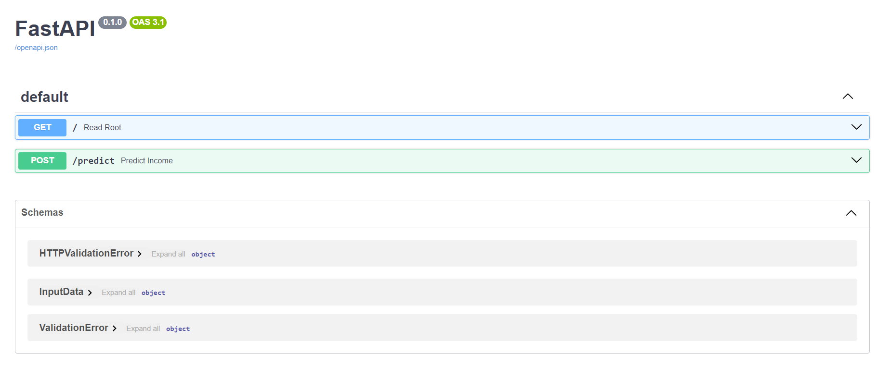

https://github.com/GusContini/Deploying-a-ML-Model-to-Cloud-Application-Platform-with-FastAPI

# Deploying-a-ML-Model-to-Cloud-Application-Platform-with-FastAPI

Development of a classification model on publicly available Census Bureau data.

### Scope:

- Developed a machine learning model using Python libraries such as scikit-learn and pandas.
- Created a web application using FastAPI to serve the machine learning model as an API.
- Configured continuous integration (CI) using GitHub Actions to lint and test the code.
- Deployed the web application to Render, a cloud platform for deploying and scaling web applications.

### Technologies used:

- Python: Used for developing the machine learning model, creating the FastAPI web application, and scripting.
- FastAPI: Web framework for building APIs with Python, used to create the web application serving the machine learning model.
- GitHub Actions: CI/CD platform provided by GitHub, used for automating linting and testing of the codebase.
- Render: Cloud platform for deploying and scaling web applications, used to deploy the FastAPI web application and host the machine learning model API.

Overall, we've developed, tested, and deployed a machine learning model as a web application, allowing users to interact with it via API requests. The continuous integration setup ensures that changes to the codebase are automatically validated, and the deployment to Render provides a scalable and reliable hosting environment for the application.
__________________________________________________________________________________________________________________________________

Run the following command to start the API:
> uvicorn main:app

Then go to this URL to access the API documentation: http://127.0.0.1:8000/docs

This is how it looks like:

There one can try out the endpoints. Here's the output of a post/predict test:

__________________________________________________________________________________________________________________________________

This model has been deployed with Render to the following URL: https://deploying-a-ml-model-to-cloud-whnf.onrender.com.

Note: This page may not be available since there are costs to keep it running.